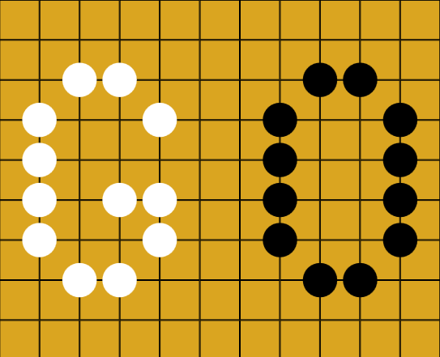

# Go Game
 


## Описание проекта

**GoGame** - это настольная игра Го (Бадук), реализованная с использованием WPF на языке C#. Цель проекта - предоставить пользователям возможность играть в Го, используя интуитивно понятный графический интерфейс. Игра поддерживает пока что один режим: игра между двумя игроками на одном устройстве, но возможно в будующим будет ии.

## Функциональные возможности

- **Игровое поле**:
  - Поле размером 19х19, 13x13 и 9x9 клеток.

- **Пользовательский интерфейс (GUI)**:
  - Удобное управление игрой.
  - Отображение текущего состояния игры (чей ход, количество захваченных камней и т.д.).
  - Взаимодействие с игровым полем (размещение камней, передача хода и т.д.).

- **Логика игры**:
  - Реализация правил Го: камни, захваты, суицид, счёт очков, конец игры и т.д.
  - Алгоритм определения победителя и расчета счета.

- **Игровые режимы**:
  - Игра против компьютера с настраиваемым уровнем сложности. > Не реализована
  - Игра между двумя игроками на одном устройстве.

- **Дополнительные функции**:
  - Сохранение и загрузка игрового состояния. > Не реализована
  - Отмена хода и возврат к предыдущему состоянию игры. > Не реализована
  - Настройка параметров игры (размер поля).

## Технологии

- **Язык программирования**: C#
- **Графический интерфейс**: WPF (Windows Presentation Foundation)
- **Логика игры**: Реализация правил игры, включая управление ходом, проверку правильности ходов, подсчёт очков и определение победителя.
- **Сохранение и загрузка состояния игры**: Использование встроенных средств сериализации данных в C# (форматы JSON/XML). 
- **Отмена хода и возврат к предыдущему состоянию**: Использование стека для сохранения истории ходов.

## P.S.

It is my first project whis git

## Установка

1. Склонируйте репозиторий:

```bash
git clone https://github.com/naotaroArt/Go-Game.git
